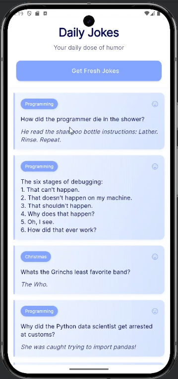
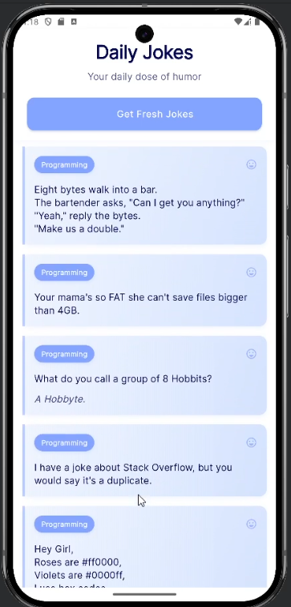

# Cached Jokes App

A Flutter mobile application that brings humor to your fingertips! The app fetches jokes from JokeAPI and caches them locally, ensuring you're always entertained, whether you're online or offline. With a clean interface and robust features, the app offers a delightful user experience.

---

## 🚀 Key Features

- **Fetch Jokes Online**: Retrieves 5 random jokes using JokeAPI.
- **Offline Mode**: Access your jokes anytime, even without an internet connection.
- **Smart Caching**: Saves jokes locally using `shared_preferences` for seamless access.
- **Automatic Updates**: Refreshes the joke cache when online.
- **Network Detection**: Automatically detects online/offline status.
- **Error-Resilient**: Handles errors gracefully, keeping the app smooth and functional.

---

## 🛠️ Technical Details

### Prerequisites
- **Flutter SDK**: Version 3.24.3 or later
- **Dart SDK**: Version 3.5.3 or later
- IDE: Android Studio or VS Code with Flutter extensions
- Device: Physical device or emulator for testing

### Dependencies
Add these to your `pubspec.yaml` file:
```yaml
dependencies:
  flutter:
    sdk: flutter
  shared_preferences: ^2.2.0
  dio: ^5.3.2
 
```

---

## 📦 Installation Guide

1. **Clone the Repository**:
   ```bash
   git clone https://github.com/SILVA-HSL/Joke_app.git
   ```

2. **Navigate to the Project Directory**:
   ```bash
   cd Joke_app
   ```

3. **Install Dependencies**:
   ```bash
   flutter pub get
   ```

4. **Run the Application**:
   ```bash
   flutter run
   ```

---

## 🏗️ Application Architecture

The app is built using a clean architecture pattern with three layers:

1. **Data Layer**: Handles API calls and local caching with `shared_preferences`.
2. **Domain Layer**: Processes business logic and defines core data models.
3. **Presentation Layer**: Displays the user interface and manages app state.

---

## ⚙️ Core Functionalities

### **Joke Caching**
Code to save and retrieve jokes:
```dart
import 'package:shared_preferences/shared_preferences.dart';

class JokeCache {
  static const String _cacheKey = 'cached_jokes';

  Future<void> saveJokes(List<String> jokes) async {
    final prefs = await SharedPreferences.getInstance();
    await prefs.setStringList(_cacheKey, jokes);
  }

  Future<List<String>> getCachedJokes() async {
    final prefs = await SharedPreferences.getInstance();
    return prefs.getStringList(_cacheKey) ?? [];
  }
}
```

### **API Integration**
Code to fetch jokes from the API:
```dart
import 'dart:convert';
import 'package:http/http.dart' as http;

class JokeService {
  final String _apiUrl = 'https://v2.jokeapi.dev/joke/Any?amount=5';

  Future<List<String>> fetchJokes() async {
    final response = await http.get(Uri.parse(_apiUrl));

    if (response.statusCode == 200) {
      final data = json.decode(response.body);
      return List<String>.from(data['jokes'].map((j) => j['setup'] + ' - ' + j['delivery']));
    } else {
      throw Exception('Failed to load jokes');
    }
  }
}
```

### **Offline Support**
Code to check connectivity status:
```dart
import 'package:connectivity_plus/connectivity_plus.dart';

Future<bool> isOnline() async {
  final result = await Connectivity().checkConnectivity();
  return result == ConnectivityResult.mobile || result == ConnectivityResult.wifi;
}
```

---

## 📸 Screenshots

| Online Mode                     | Cached Jokes                     | Cached Jokes                   |
|---------------------------------|----------------------------------|--------------------------------|
|   |    |  |

---

Enjoy a world of humor wherever you are! 😊
